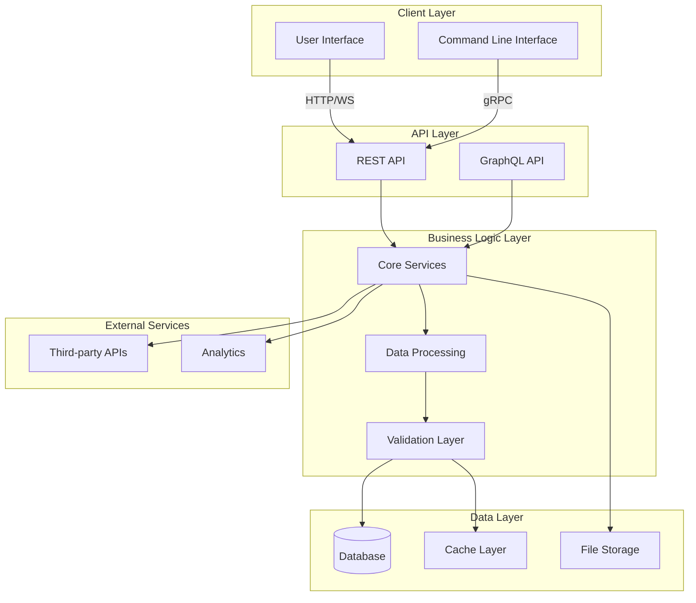
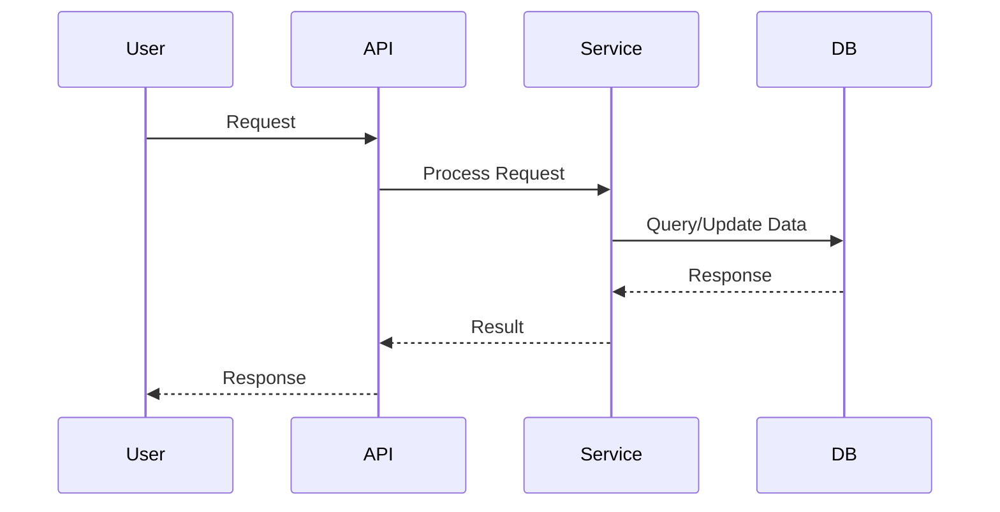
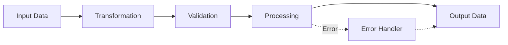

# Architecture Overview

This document provides an architecture overview of the conyag-max project.

## System Architecture

## Component Interaction

## Data Flow

---

**Last Updated:** 2026-05-29

For more information about this project, see the main README.
