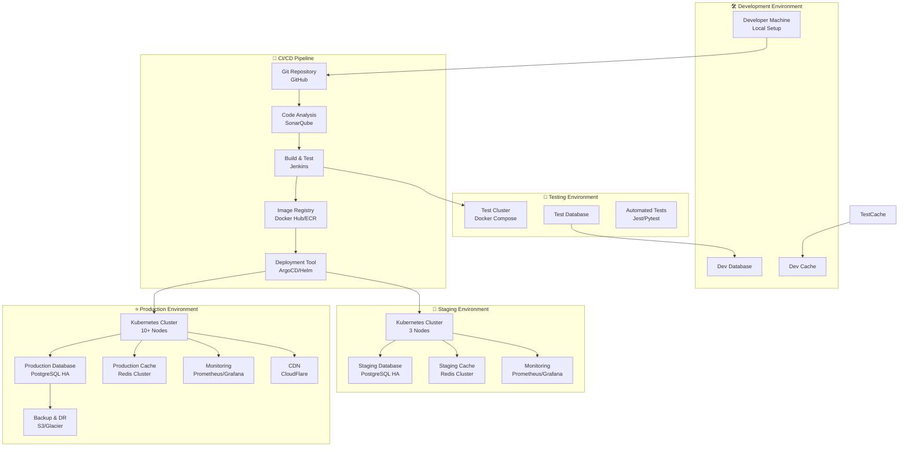
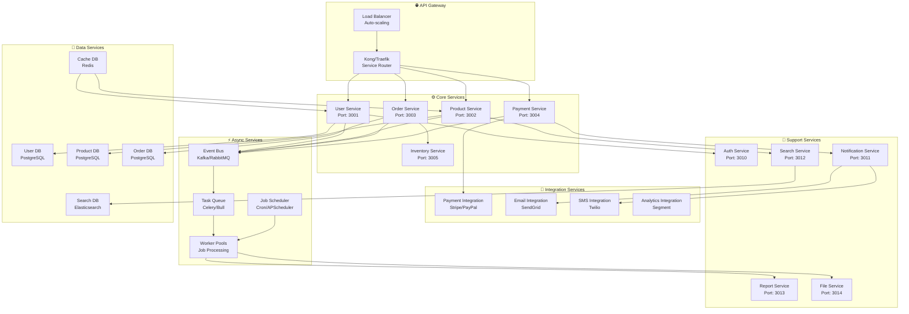
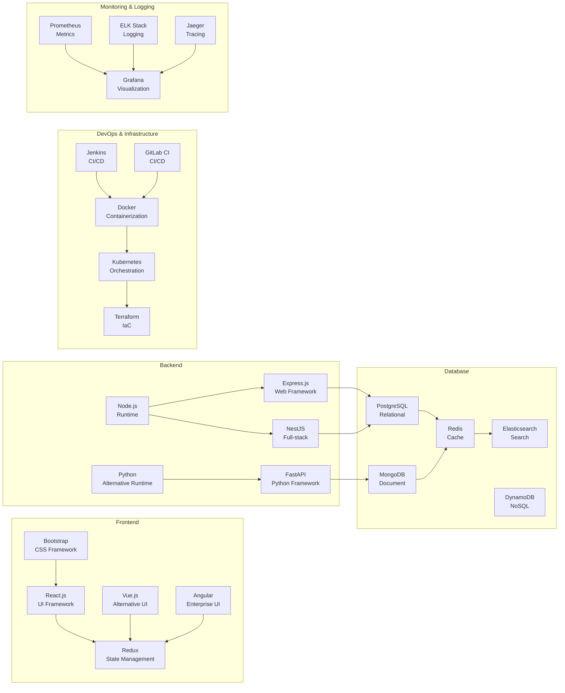

# Architecture Overview

This document provides a comprehensive architecture overview of the conyag-max project, detailing all system components, layers, and interactions.

## Table of Contents
- [System Architecture](#system-architecture)
- [Component Architecture](#component-architecture)
- [Data Flow Architecture](#data-flow-architecture)
- [Deployment Architecture](#deployment-architecture)
- [Security Architecture](#security-architecture)
- [Microservices Architecture](#microservices-architecture)
- [Technology Stack](#technology-stack)
- [Integration Points](#integration-points)

---

## System Architecture

```mermaid
graph TB
    subgraph Client["🖥️ Client Layer"]
        WebUI["Web UI<br/>React/Vue/Angular"]
        MobileApp["Mobile App<br/>iOS/Android"]
        CLI["CLI Tool<br/>Command Line"]
        Desktop["Desktop App<br/>Electron/PyQt"]
    end
    
    subgraph Gateway["🌐 API Gateway Layer"]
        LoadBalancer["Load Balancer<br/>Nginx/HAProxy"]
        APIGateway["API Gateway<br/>Kong/Traefik"]
        RateLimiter["Rate Limiter"]
        AuthGateway["Auth Gateway"]
    end
    
    subgraph API["📡 API Layer"]
        REST["REST API<br/>Express/FastAPI"]
        GraphQL["GraphQL API<br/>Apollo/Graphene"]
        WebSocket["WebSocket Server<br/>Real-time"]
        gRPC["gRPC Services"]
    end
    
    subgraph Business["⚙️ Business Logic Layer"]
        UserService["User Service"]
        ProductService["Product Service"]
        OrderService["Order Service"]
        PaymentService["Payment Service"]
        NotificationService["Notification Service"]
        ReportingService["Reporting Service"]
        AnalyticsService["Analytics Service"]
        ValidationLayer["Validation Engine"]
    end
    
    subgraph Processing["🔄 Processing Layer"]
        QueueManager["Queue Manager<br/>RabbitMQ/Kafka"]
        JobProcessor["Job Processor"]
        BatchProcessor["Batch Processing"]
        DataProcessor["Data Processor"]
        ImageProcessor["Image Processor"]
        DocumentProcessor["Document Processor"]
    end
    
    subgraph Data["💾 Data Layer"]
        PrimaryDB["Primary Database<br/>PostgreSQL"]
        ReadReplica["Read Replica<br/>PostgreSQL"]
        Cache["Redis Cache"]
        SessionStore["Session Store"]
        SearchIndex["Search Index<br/>Elasticsearch"]
    end
    
    subgraph Storage["📦 Storage Layer"]
        FileStorage["File Storage<br/>S3/MinIO"]
        DocumentStore["Document Store<br/>MongoDB"]
        BlobStorage["Blob Storage"]
        CDN["CDN<br/>CloudFront/CloudFlare"]
    end
    
    subgraph External["🔗 External Services"]
        PaymentGateway["Payment Gateway<br/>Stripe/PayPal"]
        EmailService["Email Service<br/>SendGrid"]
        SMSService["SMS Service<br/>Twilio"]
        ThirdPartyAPI["Third-party APIs"]
        MapService["Map Service<br/>Google Maps"]
    end
    
    subgraph Monitoring["📊 Monitoring & Logging"]
        Prometheus["Prometheus<br/>Metrics"]
        ELK["ELK Stack<br/>Logging"]
        Jaeger["Distributed Tracing<br/>Jaeger"]
        Alerts["Alert Manager"]
    end
    
    subgraph Security["🔐 Security Layer"]
        WAF["Web Application Firewall"]
        VPN["VPN Gateway"]
        SecretManager["Secret Manager<br/>Vault"]
        SSL["SSL/TLS Certificates"]
    end
    
    WebUI -->|HTTPS| LoadBalancer
    MobileApp -->|HTTPS| LoadBalancer
    CLI -->|gRPC| LoadBalancer
    Desktop -->|HTTPS| LoadBalancer
    
    LoadBalancer --> APIGateway
    APIGateway --> RateLimiter
    APIGateway --> AuthGateway
    
    RateLimiter --> REST
    RateLimiter --> GraphQL
    RateLimiter --> WebSocket
    AuthGateway --> gRPC
    
    REST --> UserService
    REST --> ProductService
    REST --> OrderService
    GraphQL --> PaymentService
    GraphQL --> NotificationService
    WebSocket --> ReportingService
    gRPC --> AnalyticsService
    
    UserService --> ValidationLayer
    ProductService --> ValidationLayer
    OrderService --> ValidationLayer
    PaymentService --> ValidationLayer
    NotificationService --> ValidationLayer
    ReportingService --> ValidationLayer
    AnalyticsService --> ValidationLayer
    
    ValidationLayer --> QueueManager
    ValidationLayer --> JobProcessor
    
    JobProcessor --> BatchProcessor
    BatchProcessor --> DataProcessor
    DataProcessor --> ImageProcessor
    ImageProcessor --> DocumentProcessor
    
    UserService --> PrimaryDB
    ProductService --> PrimaryDB
    OrderService --> PrimaryDB
    PaymentService --> PrimaryDB
    
    PrimaryDB --> ReadReplica
    ReadReplica --> Cache
    Cache --> SessionStore
    
    DataProcessor --> SearchIndex
    
    ImageProcessor --> FileStorage
    DocumentProcessor --> DocumentStore
    UserService --> BlobStorage
    
    FileStorage --> CDN
    
    PaymentService --> PaymentGateway
    NotificationService --> EmailService
    NotificationService --> SMSService
    ReportingService --> ThirdPartyAPI
    AnalyticsService --> MapService
    
    REST -.->|metrics| Prometheus
    GraphQL -.->|metrics| Prometheus
    PrimaryDB -.->|logs| ELK
    JobProcessor -.->|traces| Jaeger
    Prometheus -.->|alerts| Alerts
    
    APIGateway --> WAF
    LoadBalancer --> VPN
    PaymentService --> SecretManager
    REST --> SSL
```

---

## Component Architecture

```mermaid
graph TB
    subgraph UserModule["👤 User Module"]
        UserModel["User Model"]
        UserController["User Controller"]
        UserService["User Service"]
        UserRepository["User Repository"]
        UserValidator["User Validator"]
        AuthMiddleware["Auth Middleware"]
    end
    
    subgraph ProductModule["📦 Product Module"]
        ProductModel["Product Model"]
        ProductController["Product Controller"]
        ProductService["Product Service"]
        ProductRepository["Product Repository"]
        CategoryManager["Category Manager"]
        InventoryManager["Inventory Manager"]
    end
    
    subgraph OrderModule["🛒 Order Module"]
        OrderModel["Order Model"]
        OrderController["Order Controller"]
        OrderService["Order Service"]
        OrderRepository["Order Repository"]
        OrderProcessor["Order Processor"]
        ShippingManager["Shipping Manager"]
    end
    
    subgraph PaymentModule["💳 Payment Module"]
        PaymentModel["Payment Model"]
        PaymentController["Payment Controller"]
        PaymentService["Payment Service"]
        PaymentProcessor["Payment Processor"]
        RefundManager["Refund Manager"]
        TransactionLogger["Transaction Logger"]
    end
    
    subgraph NotificationModule["📧 Notification Module"]
        NotificationModel["Notification Model"]
        NotificationController["Notification Controller"]
        EmailHandler["Email Handler"]
        SMSHandler["SMS Handler"]
        PushHandler["Push Notification Handler"]
        TemplateEngine["Template Engine"]
    end
    
    subgraph AnalyticsModule["📈 Analytics Module"]
        EventCollector["Event Collector"]
        DataAggregator["Data Aggregator"]
        ReportGenerator["Report Generator"]
        DashboardService["Dashboard Service"]
        MetricsCalculator["Metrics Calculator"]
    end
    
    subgraph SearchModule["🔍 Search Module"]
        SearchEngine["Search Engine"]
        IndexManager["Index Manager"]
        QueryParser["Query Parser"]
        ResultRanker["Result Ranker"]
        FilterEngine["Filter Engine"]
    end
    
    UserController --> UserService
    UserService --> UserRepository
    UserService --> UserValidator
    UserController --> AuthMiddleware
    
    ProductController --> ProductService
    ProductService --> ProductRepository
    ProductService --> CategoryManager
    ProductService --> InventoryManager
    
    OrderController --> OrderService
    OrderService --> OrderRepository
    OrderService --> OrderProcessor
    OrderService --> ShippingManager
    
    PaymentController --> PaymentService
    PaymentService --> PaymentProcessor
    PaymentService --> RefundManager
    PaymentService --> TransactionLogger
    
    NotificationController --> EmailHandler
    NotificationController --> SMSHandler
    NotificationController --> PushHandler
    EmailHandler --> TemplateEngine
    SMSHandler --> TemplateEngine
    
    EventCollector --> DataAggregator
    DataAggregator --> ReportGenerator
    DataAggregator --> MetricsCalculator
    ReportGenerator --> DashboardService
    
    SearchEngine --> IndexManager
    SearchEngine --> QueryParser
    QueryParser --> ResultRanker
    ResultRanker --> FilterEngine
```

---

## Data Flow Architecture

```mermaid
graph LR
    subgraph Input["Input Stage"]
        ClientReq["Client Request"]
        FormData["Form Data"]
        FileUpload["File Upload"]
        APIData["API Data"]
    end
    
    subgraph Validation["Validation Stage"]
        SchemValidation["Schema Validation"]
        BusinessRules["Business Rules"]
        SecurityCheck["Security Check"]
        DuplicateCheck["Duplicate Check"]
    end
    
    subgraph Processing["Processing Stage"]
        Transform["Data Transform"]
        Enrich["Data Enrichment"]
        Calculate["Calculations"]
        Aggregate["Data Aggregation"]
    end
    
    subgraph Storage["Storage Stage"]
        WriteToDB["Write to DB"]
        UpdateCache["Update Cache"]
        IndexSearch["Index Search"]
        ArchiveData["Archive Data"]
    end
    
    subgraph Output["Output Stage"]
        APIResponse["API Response"]
        Notification["Notifications"]
        Report["Reports"]
        Analytics["Analytics Events"]
    end
    
    subgraph ErrorHandling["Error Handling"]
        ErrorLog["Error Logging"]
        ErrorNotify["Error Notification"]
        ErrorRetry["Retry Logic"]
        ErrorRecovery["Recovery Strategy"]
    end
    
    ClientReq --> SchemValidation
    FormData --> SchemValidation
    FileUpload --> SchemValidation
    APIData --> SchemValidation
    
    SchemValidation --> BusinessRules
    BusinessRules --> SecurityCheck
    SecurityCheck --> DuplicateCheck
    
    DuplicateCheck --> Transform
    Transform --> Enrich
    Enrich --> Calculate
    Calculate --> Aggregate
    
    Aggregate --> WriteToDB
    WriteToDB --> UpdateCache
    UpdateCache --> IndexSearch
    IndexSearch --> ArchiveData
    
    ArchiveData --> APIResponse
    APIResponse --> Notification
    Notification --> Report
    Report --> Analytics
    
    SchemValidation -.->|Error| ErrorLog
    BusinessRules -.->|Error| ErrorLog
    SecurityCheck -.->|Error| ErrorLog
    WriteToDB -.->|Error| ErrorLog
    
    ErrorLog --> ErrorNotify
    ErrorLog --> ErrorRetry
    ErrorRetry -.->|Retry| Transform
    ErrorLog --> ErrorRecovery
```

---

## Deployment Architecture

---

## Security Architecture

```mermaid
graph TB
    subgraph Perimeter["🛡️ Perimeter Security"]
        WAF["Web Application Firewall<br/>ModSecurity"]
        DDOS["DDoS Protection<br/>CloudFlare"]
        VPN["VPN Gateway<br/>OpenVPN"]
        IPWhitelist["IP Whitelisting"]
    end
    
    subgraph AuthN["🔑 Authentication"]
        OAuth2["OAuth 2.0<br/>Google/GitHub"]
        SAML["SAML SSO<br/>Enterprise"]
        JWT["JWT Tokens<br/>RS256"]
        MFA["Multi-Factor Auth<br/>TOTP/SMS"]
        Biometric["Biometric Auth<br/>Fingerprint/Face"]
    end
    
    subgraph AuthZ["🚪 Authorization"]
        RBAC["Role-Based Access<br/>Control"]
        ABAC["Attribute-Based<br/>Access Control"]
        ACL["Access Control Lists"]
        PolicyEngine["Policy Engine<br/>OPA/Kyverno"]
    end
    
    subgraph DataSec["🔐 Data Security"]
        Encryption["Encryption<br/>AES-256/TLS 1.3"]
        KeyManagement["Key Management<br/>AWS KMS/Vault"]
        DataMasking["Data Masking"]
        TokenVault["Token Vault<br/>HashiCorp Vault"]
    end
    
    subgraph Audit["📋 Audit & Compliance"]
        AuditLog["Audit Logging<br/>ELK Stack"]
        Compliance["Compliance Checks<br/>GDPR/HIPAA"]
        Vulnerability["Vulnerability Scan<br/>Trivy/Aqua"]
        Penetration["Penetration Testing"]
    end
    
    subgraph NetworkSec["🌐 Network Security"]
        NetworkPolicy["Network Policies<br/>K8s NetworkPolicy"]
        Firewall["Firewall Rules"]
        ZeroTrust["Zero Trust Network<br/>Envoy/Istio"]
        ServiceMesh["Service Mesh<br/>Istio/Linkerd"]
    end
    
    DDOS --> WAF
    WAF --> VPN
    VPN --> IPWhitelist
    
    OAuth2 --> JWT
    SAML --> JWT
    JWT --> MFA
    MFA --> Biometric
    
    JWT --> RBAC
    RBAC --> ABAC
    ABAC --> ACL
    ACL --> PolicyEngine
    
    Encryption --> KeyManagement
    KeyManagement --> DataMasking
    DataMasking --> TokenVault
    
    AuditLog --> Compliance
    Compliance --> Vulnerability
    Vulnerability --> Penetration
    
    NetworkPolicy --> Firewall
    Firewall --> ZeroTrust
    ZeroTrust --> ServiceMesh
```

---

## Microservices Architecture

---

## Technology Stack

---

## Integration Points

```mermaid
graph TB
    subgraph Internal["Internal Systems"]
        UserService["User Service"]
        OrderService["Order Service"]
        InventoryService["Inventory Service"]
        NotificationService["Notification Service"]
    end
    
    subgraph Payment["Payment Integrations"]
        Stripe["Stripe API<br/>Credit Cards"]
        PayPal["PayPal API<br/>Digital Wallets"]
        Square["Square API<br/>POS"]
        Adyen["Adyen API<br/>Multi-currency"]
    end
    
    subgraph Communication["Communication"]
        SendGrid["SendGrid<br/>Email Service"]
        Twilio["Twilio<br/>SMS/Voice"]
        Firebase["Firebase<br/>Push Notifications"]
        Slack["Slack API<br/>Team Communication"]
    end
    
    subgraph Analytics["Analytics & Tracking"]
        GoogleAnalytics["Google Analytics<br/>Web Analytics"]
        Mixpanel["Mixpanel<br/>Event Tracking"]
        Segment["Segment<br/>Data Pipeline"]
        DataDog["DataDog<br/>APM"]
    end
    
    subgraph Shipping["Shipping & Logistics"]
        FedEx["FedEx API<br/>Shipping"]
        UPS["UPS API<br/>Tracking"]
        ShipStation["ShipStation<br/>Fulfillment"]
        EasyPost["EasyPost<br/>Multi-carrier"]
    end
    
    subgraph Maps["Location Services"]
        GoogleMaps["Google Maps<br/>Geocoding"]
        MapBox["MapBox<br/>Mapping"]
        GeoIP["GeoIP Database<br/>Location"]
    end
    
    subgraph Cloud["Cloud Services"]
        AWS["AWS<br/>Infrastructure"]
        GCP["Google Cloud<br/>Infrastructure"]
        Azure["Microsoft Azure<br/>Infrastructure"]
        CDN["CloudFlare CDN<br/>Content Delivery"]
    end
    
    UserService --> Stripe
    UserService --> PayPal
    OrderService --> Square
    OrderService --> Adyen
    
    NotificationService --> SendGrid
    NotificationService --> Twilio
    NotificationService --> Firebase
    UserService --> Slack
    
    OrderService --> GoogleAnalytics
    InventoryService --> Mixpanel
    UserService --> Segment
    OrderService --> DataDog
    
    OrderService --> FedEx
    OrderService --> UPS
    OrderService --> ShipStation
    OrderService --> EasyPost
    
    UserService --> GoogleMaps
    OrderService --> MapBox
    UserService --> GeoIP
    
    InventoryService --> AWS
    OrderService --> GCP
    UserService --> Azure
    NotificationService --> CDN
```

---

## Key Features & Capabilities

### Scalability
- Horizontal scaling with Kubernetes
- Load balancing across multiple nodes
- Database replication and sharding
- Caching layer for performance optimization

### Reliability
- High availability with multi-region deployment
- Automatic failover mechanisms
- Data backup and disaster recovery
- Circuit breaker patterns

### Security
- End-to-end encryption
- Multi-factor authentication
- Role-based access control
- Regular security audits and penetration testing

### Performance
- CDN for static content delivery
- Caching strategies (Redis, Memcached)
- Database query optimization
- API response compression

### Observability
- Distributed tracing
- Real-time monitoring
- Comprehensive logging
- Performance metrics collection

---

**Last Updated:** 2026-05-29

For more information about this project, see the main README.
